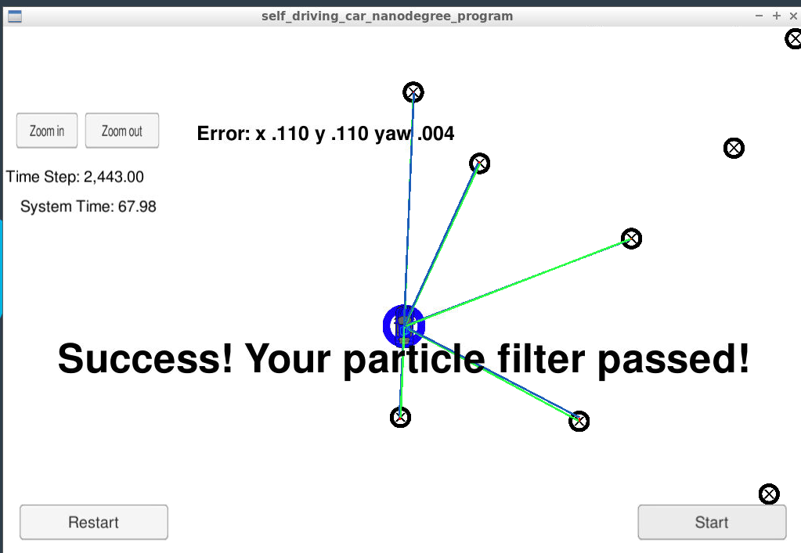

# Particle Filter

My own Project from SDC Udacity Course (Project 6). This code implements a Particle Filter, which uses probability, initial GPS position and sensed landmarks to get the exact position of a car, given a known map.

## RSME using both sensor

1. src/particle.cpp --> main functions of the Particle Filter implemented
2. src/debugger_functions.cpp, scr/multiv_gauss.cpp --> additional functions for Particle Filter

> Source Project
> https://github.com/udacity/CarND-Kidnapped-Vehicle-Project
